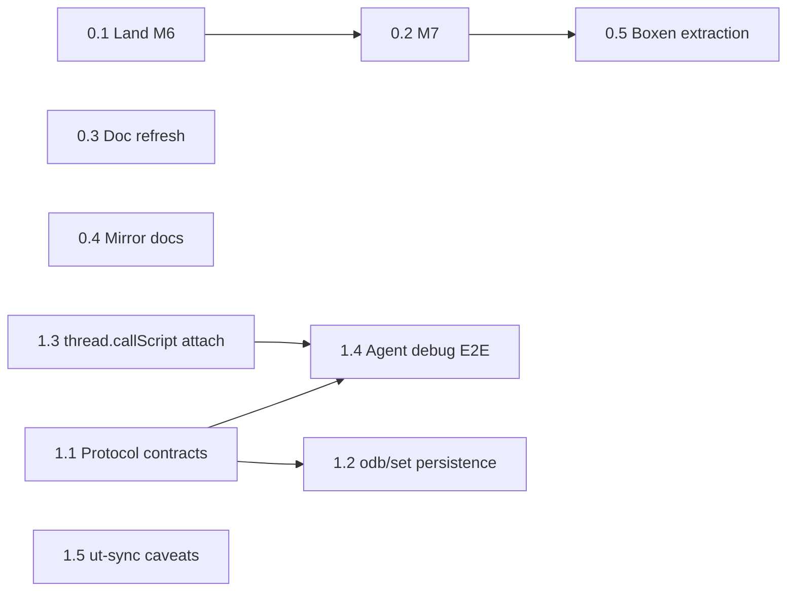

# Frontier 1.0 — Phase 0 + Phase 1 Execution Plan

> **For agentic workers:** Execute this plan unit-by-unit via the project's own workflow machinery (`/auto`, `/doit`, `/fleet`, `/diagnose`, `/gate`). Each code unit's TDD micro-plan (failing tests first, red-then-green) is generated at dispatch time per `~/.claude/docs/tdd-dispatch-template.md` — this document defines units, interfaces, dependencies, and acceptance criteria. Checkboxes track unit completion.

**Goal:** Complete Vision Phases 0–1: clear the decks (land M6/M7, boxen extraction kickoff, planning-doc truth refresh, doc-site mirroring), then make protocol mode a hardened machine interface and agent-driven debugging work end-to-end — before any Manila work begins.

**Architecture:** No new subsystems. Phase 0 lands in-flight boxen work and repairs project ground truth; Phase 1 hardens the existing `--protocol` NDJSON interface (`frontier-cli/protocol_handler.c`), fixes debugger attach for `thread.callScript` threads, and closes known `--ut-sync-dir` correctness caveats.

**Tech Stack:** C (c17 CLI / c99 tests), UserTalk, YAML integration harness (`tests/integration/`), NDJSON protocol, boxen/termbox2.

**Spec:** `product/VISION_1_0.md` (Phases 0–1). Where this plan and the spec conflict, the spec wins.

## Global Constraints

- Branch-first always; base branch `develop`; squash merges; unit + integration suites must pass before push and merge (`./tools/run_headless_tests.sh`; `cd tests && make test-integration`).
- Tabs in C; ASCII-only commit messages; no `--no-verify`.
- Docs-only units commit direct to develop (no PR ceremony).
- Never delete legacy code paths as a side effect of these units.
- `/gate` before merge on code units (bar-raiser + security always; concurrency tier auto-triggers on GIL/pthread paths — expected to fire on U1.3/U1.4).
- Priority order everywhere: security > maintainability > extensibility > readability.

---

## Phase 0 — Clear the decks

### Unit 0.1: Land input_decoder M6 (cutover)

**State:** branch `phase-c-m6-cutover` exists locally + on origin, 1 commit ahead (`6e69fa298`, "input_decoder cutover in tb2 backend"). Worktree `.claude/worktrees/phase-c-m6-cutover` exists.

**Files:** whatever the branch touches (expect `frontier-cli/boxen/backend_tb2.c`, `input_decoder.c/h`); plan of record `planning/phase_c/INPUT_DECODER_PLAN.md` M6.

**Work:** rebase branch on current develop; verify the cutover replaces `tb2_poll_event` read-side per plan; run boxen unit tests (`boxen_input_tests` etc.) + full suites; PR; gate; merge.

**Acceptance:** all boxen + unit + integration suites green; interactive smoke in a real terminal (keys, mouse, paste, Kitty protocol) per M5 acceptance list in the plan doc; `develop` contains the cutover.

**Interfaces — Produces:** input events flow through `input_decoder` in the tb2 backend; M7 builds on this.

- [ ] Unit complete (PR merged, suites green)

### Unit 0.2: input_decoder M7 (mouse-mode policy + `/mouse` toggle)

**Depends:** 0.1.

**Files:** `frontier-cli/boxen/input_decoder.c/h`, `frontier-cli/boxen_repl.c` (slash-command table), `planning/phase_c/INPUT_DECODER_PLAN.md` M7 section is the spec; tests in `tests/boxen_input_tests.c` + PTY-replay harness (`tests/` M1 harness).

**Work:** implement the M7 milestone as specced (mouse-mode enable/disable policy, `/mouse` toggle surfaced in the REPL palette); behavioral tests via the PTY-replay harness.

**Acceptance:** M7 acceptance criteria in INPUT_DECODER_PLAN.md met; toggle works live; suites green; plan doc updated to mark M1–M7 complete.

- [ ] Unit complete (PR merged, suites green)

### Unit 0.3: Planning-doc truth refresh (docs-only, direct to develop)

**Files (modify):** `planning/_CURRENT_STATUS.md`, `planning/_CURRENT_TODO_LIST.md`, `planning/INDEX.md`, `planning/phase4/PROGRESS.md`, `planning/phase4/p0a-critical-thread-safety/README.md`, `planning/architectural_decision_records/README.md`, `planning/MANILA_MAINRESPONDER_E2E.md`, `docs/TCP_ARCHITECTURE.md` (verb count), `planning/phase4/networking/INDEX.md`.

**Corrections of record (verified against git during research 2026-08-09):**
- P0a hash-table migration: `currenthashtable` is thread-local since PR #536 (2026-04-15); `hashtablestack` remains global (bootstrap constraint — the live split-brain, bug #706). Docs claiming "P0a not started / 0 globals" are wrong.
- TCP: 23/23 verbs complete (PR #361), not 11 or 13/22.
- ADR index: runs through ADR-017, not 011. `planning/DECISIONS.md` is abandoned and should say so.
- `MANILA_MAINRESPONDER_E2E.md` Status Snapshot: Phase A merged (#541, `d8db43416`), Phase B merged (#543, `c17fc2272`); Phase B's smoke test currently `skip: true` under #620.
- Test baseline: "0 failures" claims must be restated as "2186 passing / 21 known failures / 47 skipped under #620"; note the baseline list lives in `/tmp` (fix tracked in Unit 2.x of the web-stack phase, out of scope here — just state it).
- Every corrected doc gets a banner pointing to `product/VISION_1_0.md` as the current direction of record.

**Acceptance:** a fresh agent reading only `planning/INDEX.md` + banners lands on accurate state and the vision doc; no doc claims contradicted by git history remain in the six named files. Pre-commit CLAUDE.md validator untouched.

- [ ] Unit complete (committed direct to develop)

### Unit 0.4: Mirror the UserLand documentation sites

**Decision needed (Jake):** destination — recommend a NEW dedicated repo (e.g. `jsavin/userland-docs-archive`) rather than this repo (size, licensing separation); NAS copy as second home.

**Files (create):** `tools/mirror_userland_docs.sh` in this repo; archive content in the destination repo.

**Work:** `wget --mirror --convert-links --page-requisites --adjust-extension` over `http://frontier.userland.com/`, `http://docserver.userland.com/`, `http://manila.userland.com/` (HTTP only — no TLS on origin); record date + byte counts in an ARCHIVE_MANIFEST.md; spot-check key pages (Manila User's Guide TOC, DocServer verb index, UserTalk manual) render offline.

**Acceptance:** all three mirrors browsable offline from the archive repo; manifest committed; script re-runnable for refresh.

- [ ] Unit complete (archive repo populated + manifest)

### Unit 0.5: Boxen extraction kickoff

**Spec:** boxen Phase E in `planning/boxen/EXECUTION_PLAN.md` (standalone repo layout, MIT, own CI, Frontier re-consumes as vendored submodule). Vision pulls the *start* of this forward; boxen API freeze is not required to begin.

**Decisions needed (Jake):** repo name (working assumption `jsavin/boxen`), public-from-day-one vs private-until-README, version to tag at extraction (suggest `0.9.0` pre-API-freeze).

**Work (first tranche only):** create the standalone repo skeleton (`include/`, `src/`, `tests/`, `examples/`, CMakeLists or Makefile, MIT LICENSE, README from `planning/boxen/OVERVIEW.md` §1–2); extraction script that copies `frontier-cli/boxen/` sources with include-path rewrite; boxen unit tests running in the standalone repo's CI (macOS + ubuntu, matching the existing `tb2-smoke` hook). Frontier keeps building from its in-tree copy for now — submodule flip is a later unit, after M6/M7 settle.

**Acceptance:** standalone repo builds + tests green on its own CI from extracted sources; documented one-command re-extraction; zero changes to Frontier's build.

- [ ] Unit complete (standalone repo green)

---

## Phase 1 — Protocol + agent-drivable debugger (P0)

### Unit 1.1: Protocol contract test suite + documented semantics

**Files:** Test: new `tests/integration/test_cases/protocol_contract_tests.yaml` (+ `protocol_mode: true` flag per runner conventions); Modify: `docs/PROTOCOL*.md` / `planning/gui/STDIO_PROTOCOL.md` (error-semantics section); Read first: `frontier-cli/protocol_handler.c` (dispatch table is ground truth — quote dispatch entry AND response-emit code before writing each parser test, per established wire-format practice).

**Work:** enumerate every implemented protocol op from the dispatch table; for each: happy-path contract test, malformed-input test (missing field, wrong type, oversized payload), and error-shape test (stable machine-readable error codes — define and document the code set if currently ad hoc). Cover at minimum: eval, script ops, odb get/set, debug ops (getSource, breakpoints, step, stack, locals), sync ops.

**Acceptance:** every dispatch-table op has contract tests; STDIO_PROTOCOL.md documents each op's request/response/error shapes and matches the tests; suites green.

**Interfaces — Produces:** the stable op contract Unit 1.4's agent harness scripts against.

- [ ] Unit complete (PR merged, suites green)

### Unit 1.2: odb/set persistence semantics — explicit and testable

**Problem:** protocol `odb/set` mutations are in-memory-only; loss-without-save is the documented contract but untestable with the current framework (`planning/INTEGRATION_TEST_GAPS.md` gap 4). A protocol GUI client could silently lose user data.

**Design decision (via /doit gate):** recommend adding an explicit `odb/save` protocol op (mirroring `db.save`) plus a `dirty` indicator in odb/set responses; alternative is autosave policy — flag for Jake, autosave conflicts with `--lock-opened-roots` semantics.

**Files:** `frontier-cli/protocol_handler.c`; tests extending the framework to support restart-then-verify across two CLI invocations (pattern exists in migration tests — `tests/integration/test_cases/migration_*.yaml` stage DBs across runs); docs as in 1.1.

**Acceptance:** a test proves mutation → no save → restart → value absent, and mutation → `odb/save` → restart → value present; contract documented; suites green.

- [ ] Unit complete (PR merged, suites green)

### Unit 1.3: Debugger attach for `thread.callScript` threads

**Problem:** scripts on `thread.callScript` threads (menu commands, background tasks) are invisible to the debugger (known issue; JES-prioritized 2026-06-01). Root cause not yet established.

**Step 1 — `/diagnose` (read-only):** trace how debugger attach binds to an execution context; enumerate hypotheses (per-thread `hthreadglobals` debug fields not propagated at thread spawn vs. attach registry keyed to main thread vs. protocol debug ops assuming REPL thread); cheapest falsification for each. **No fix until the five root-cause questions are answerable.** Watch for ADR-012 territory (background pthread → UserTalk callback segfault) — any fix must not add a new background-thread → UserTalk path.

**Step 2 — fix via /auto with the diagnosis attached.** Expect `Common/source/lang*.c` thread-globals plumbing + `frontier-cli/protocol_handler.c` debug ops; failing test first: protocol-driven session sets a breakpoint in a script, invokes it via `thread.callScript`, expects a hit notification (currently: no hit).

**Acceptance:** breakpoint in a `thread.callScript`-launched script hits, stack/locals inspectable, stepping works, over both protocol mode and the TUI debugger; no regression in existing debugger tests (`tests/debugger_*`); concurrency gate reviewer passes it.

- [ ] Diagnosis complete (theory + evidence documented)
- [ ] Fix complete (PR merged, suites green)

### Unit 1.4: Agent-driven debugging end-to-end

**Depends:** 1.1, 1.3.

**Files:** Create: `tests/integration/agent_debug_session_test.py` (PTY/subprocess-driven, patterned on `tests/debugger_tui_pty_test.py`) exercising a full scripted session over `--protocol`; Create: `docs/AGENT_DEBUGGING_GUIDE.md` — the playbook an AI agent follows (op sequences for attach → breakpoint → run → inspect → step → eval → detach, with expected responses).

**Work:** scripted end-to-end session against a fixture script (including one `thread.callScript` case from 1.3); then a live validation run where a Claude agent, given only the guide + protocol access, sets a breakpoint and diagnoses a seeded bug — the vision requires "verified by an agent actually driving a debug session."

**Acceptance:** scripted E2E test green in CI (`sequential: true` — REPL/port constraints); live agent run documented (transcript or summary committed alongside the guide); guide sufficient without tribal knowledge.

- [ ] Unit complete (E2E test green + live agent validation)

### Unit 1.5: ut-sync caveat closure

**Problem (from `docs/usertalk/UT_SYNC_WORKFLOW.md` + ODB_UT_SYNC_DESIGN.md):** (a) mtime last-write-wins can silently discard the newer side; (b) a broken `.ut` file imports silently, installing a non-compiling script (the Virgin.root startup-script drift incident, ADR-017 context).

**Files:** the sync implementation reached from `--ut-sync-dir` in `frontier-cli/` (locate via `ODB_UT_SYNC_DESIGN.md`); tests: extend existing ut-sync integration tests; note in-flight worktree `ut-sync-deletion-leaves` — check its state before starting to avoid collision.

**Work:** (a) on inbound `.ut` import, compile-check before install; on failure, reject the import, keep the ODB version, surface a loud diagnostic (and a `repl.syncscan()` report entry); (b) conflict detection: when both sides changed since last reconcile (content hash recorded at sync time, not mtime alone), refuse to clobber and report, rather than last-write-wins.

**Acceptance:** failing tests first for both behaviors (broken `.ut` → rejected + reported; both-sides-changed → conflict surfaced, no silent loss); suites green; UT_SYNC_WORKFLOW.md caveats section updated to reflect the new guarantees.

- [ ] Unit complete (PR merged, suites green)

---

## Dependency graph

Parallel-safe from day one: 0.1, 0.3, 0.4, 1.1, 1.5 (and 1.3's diagnosis). 0.5 can start its repo-skeleton half immediately; extraction waits for M6/M7 to land.

## Decisions Jake owns (blocking their units only)

1. Unit 0.4 — archive destination repo/name.
2. Unit 0.5 — boxen repo name, visibility, initial version tag.
3. Unit 1.2 — explicit `odb/save` op vs autosave policy (recommendation: explicit op + dirty flag).

## Out of scope (resist the temptation)

Phase 2+ work (#620 triage, accept-callback bugs, Manila), ADR-017 resolution (1.5 feeds it, doesn't decide it), boxen submodule flip, any UserTalk language change, protocol v2 WebSocket/JSON-RPC transport (stdio NDJSON only — transport expansion is GUI-track work, post-1.0).
